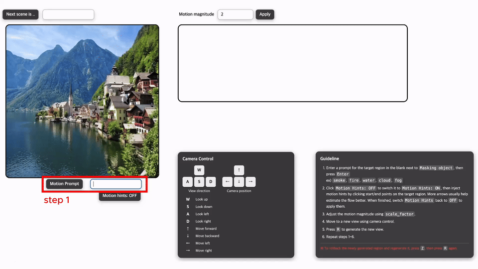

# LivingWorld: Interactive 4D World Generation with Environmental Dynamics

<div align="center">

[](https://paper.pnu-cvsp.com/LivingWorld/)
[](https://arxiv.org/abs/2604.01641)

[Hyeongju Mun](https://www.pnu-cvsp.com/members/hyeong-ju)* · [In-Hwan Jin](https://www.pnu-cvsp.com/members/inhwan)* · [Sohyeong Kim](https://www.pnu-cvsp.com/members/sohyeong) · [Kyeongbo Kong](https://www.pnu-cvsp.com/prof)†

*Equal contribution. †Corresponding author.

</div>

## Getting Started

### Installation
For the installation to be done correctly, please proceed only with CUDA-compatible GPU available.
It requires 48GB GPU memory to run.

Clone the repo and create the environment:

```bash
git clone https://github.com/<YOUR_GITHUB_USERNAME>/LivingWorld.git
cd LivingWorld
conda create --name livingworld python=3.10
conda activate livingworld
```

Install PyTorch and CUDA-dependent rendering modules. We tested with `torch==2.7.1` and CUDA 12.8. Other CUDA versions may work, but the PyTorch/CUDA versions should match your system.

```bash
pip install torch==2.7.1 torchvision==0.22.1 torchaudio==2.7.1 --index-url https://download.pytorch.org/whl/cu128
conda install -c conda-forge cmake ninja git
conda install -c fvcore -c iopath -c conda-forge fvcore iopath

pip install "git+https://github.com/facebookresearch/pytorch3d.git@stable"
pip install submodules/depth-diff-gaussian-rasterization-min/
pip install submodules/simple-knn/
pip install "git+https://github.com/NVlabs/tiny-cuda-nn/#subdirectory=bindings/torch"
```

Install the rest of the requirements:

```bash
pip install -r requirements.txt
cd RepViT/sam
pip install -e .
cd ../..
python -m spacy download en_core_web_sm
```

Export your OpenAI API key if you want to use GPT-4 to generate scene descriptions:

```bash
export OPENAI_API_KEY='your_api_key_here'
```

Export your Hugging Face token to download gated or authenticated model weights:

```bash
export HF_TOKEN='your_huggingface_token_here'
```

Download the RepViT-SAM checkpoint and put it in the root directory:

```bash
wget https://github.com/THU-MIG/RepViT/releases/download/v1.0/repvit_sam.pt
```

If you use the bundled MoGe depth/normal model and SAM3 modules, their weights are downloaded automatically from Hugging Face on first use.

### Run examples 

- Example config file

  To run an example, first you need to write a config. An example config `./config/example.yaml` is shown below (more examples are located at `config/more_examples`, feel free to try):

  ```yaml
  runs_dir: output/como
  example_name: como
  
  seed: 1
  # enable guided depth diffusion
  depth_conditioning: True
  
  # use gpt to generate scene description
  use_gpt: False
  debug: True
  
  # depth model and camera/depth parameters
  depth_model: moge
  camera_speed: 0.001
  fg_depth_range: 0.015
  depth_shift: 0.001
  sky_hard_depth: 0.02
  init_focal_length: 960
  
  # re-generate sky panorama images
  gen_sky_image: False
  # generate sky point cloud
  gen_sky: False
  
  # enable layer-wise generation
  gen_layer: True
  # load previously generated gaussians
  load_gen: False
  ```

- Run

  ###### Local Visualization Setup:
  
  Use the `splat/` viewer included in this repository and open `splat/index_stream.html` on your local laptop.
  
  To enable interactive visualization through the local browser, follow these steps:
  
  - Ensure you have `'ssh'` installed on your local machine.
  - The main program will run on `user_id@server_name`.
  - The socket port in `splat/main_stream.js` must match the `--port` argument used to run `run.py`. For example, if `main_stream.js` connects to `http://127.0.0.1:7778`, run the server with `--port 7778` and forward port `7778`.
  
  ```shell
  # On your local machine
  ssh -L 7778:localhost:7778 server_name
  ```
  
  ###### Main Program Running:
  
  On the server, run the main program:
  
  ```bash
  # On user_id@server_name
  CUDA_VISIBLE_DEVICES=0 python run.py \
    --example_config config/more_examples/venice.yaml \
    --port 7778 \
    --input_dir input/mhj/venice
  ```
  More examples are located at `config/more_examples`, feel free to try!
  
  ###### Interactive Spatial Generation Step:
  
  Open `index_stream.html` on your local machine to visualize and navigate the generated scene. This spatial expansion interface follows the WonderWorld-style interactive workflow, while LivingWorld extends the pipeline toward 4D world generation with environmental dynamics.
  
  1. If `use_gpt=True`, the next-scene prompt is generated automatically. Otherwise, enter the desired scene description in the browser interface.
  2. Navigate to a target viewpoint and press `R` to spatially expand the scene from the selected view.
  3. If the result is unsatisfactory, press `Z` to undo the latest spatial generation and try another prompt or viewpoint.
  4. Repeat the process to build a connected spatial scene.
  5. Press `X` to save the current scene. The saved Gaussian scene and motion model are stored under `--input_dir/model`, and can be loaded later by setting `load_gen=True`.

  ##### **Interactive Motion Generation Step**

  <p align="center">
    
  </p>

  This is the main LivingWorld step for adding environmental dynamics. After pressing `R` during spatial generation, the selected view is shown as a paused image for motion annotation.

  1. Enter a text prompt for the region where motion should be applied.
  2. Specify the motion direction by placing paired points on the image. Each pair represents a start point and an end point, forming a direction arrow. Adding multiple point pairs helps define a more stable and detailed motion field.
  3. After the motion is applied, adjust the motion magnitude in the GUI until the dynamics match the desired strength.

### How to add more examples?

We highly encourage you to add new images and try new stuff!
You would need to prepare the image-caption pairing separately. For real-world examples, you can collect images from sources such as Pexels or Unsplash and write the description manually or generate it with a vision-language model.

- Add a new image in `./examples/images/`.

- Add content of this new image in `./examples/examples.yaml`.

  Here is an example:

  ```yaml
  - name: new_example
    image_filepath: examples/images/new_example.png
    style_prompt: DSLR 35mm landscape
    content_prompt: scene name, object 1, object 2, object 3
    negative_prompt: ''
    background: ''
  ```

  - **content_prompt**: "scene name", "object 1", "object 2", "object 3"

  - **negative_prompt** and **background** are optional

- Write a config `config/new_example.yaml` like `./config/example.yaml` for the new example.

- Run the program following the [previous section](#run-examples). (For the first time use, the model will automatically generate the panorama sky images for the example, which takes about 20 minutes on A6000 GPU. After the corresponding sky images for the example are stored, later use of this example will automatically skip this step)


## Citation

```
@article{mun2026livingworld,
    title={LivingWorld: Interactive 4D World Generation with Environmental Dynamics},
    author={Mun, Hyeongju and Jin, In-Hwan and Kim, Sohyeong and Kong, Kyeongbo},
    journal={arXiv preprint arXiv:2604.01641},
    year={2026}
}
```

## Acknowledgement

Big thanks to the authors of [WonderWorld](https://github.com/KovenYu/WonderWorld). This codebase is built upon WonderWorld, which provides the baseline framework for interactive 3D scene generation from a single image.

We appreciate the authors of [WonderWorld](https://kovenyu.com/wonderworld/), [Marigold](https://github.com/prs-eth/Marigold), [SyncDiffusion](https://github.com/KAIST-Visual-AI-Group/SyncDiffusion), [RepViT](https://github.com/THU-MIG/RepViT), [Stable Diffusion](https://huggingface.co/stabilityai/stable-diffusion-2-inpainting), and [OneFormer](https://github.com/SHI-Labs/OneFormer) for sharing their code and models.
